# Quark — Architecture & Design Reference

## 1. Vision & Philosophy

**Agent = Model + Harness.**

The model provides intelligence. The harness makes that intelligence useful. Quark owns everything except the model's reasoning: tool execution, memory, context management, state persistence, permissions, and guardrails.

**The agent adapts to your system. Your system doesn't adapt to the agent.**

Users teach the agent their workflow through tools they define, skills they write, and plugins they drop in. The barrier to extension is deliberately low — a tool is a TypeScript function with a Zod schema. A skill is a Markdown file.

**Design axioms:**

- No kitchen-sink system prompts — profiles carry only what they need
- No global skill pools — skills are bound to profiles, not dumped at startup
- No framework abstractions — Vercel AI SDK used directly, no extra layers
- No speculative features — build what's needed now
- No verbal guardrails — if it can be enforced mechanically, it must be

---

## 2. Target Users

| Persona | Description | Primary Surface |
|---|---|---|
| Developer (daily driver) | Software engineer using Quark as their primary AI coding assistant | TUI, Desktop |
| Platform engineer | Builds internal tooling, CI/CD integrations, custom agent workflows | SDK + CLI |
| Power user | Extends Quark with custom tools, plugins, and skills for domain-specific workflows | All surfaces |
| Casual user | Interacts with the agent via browser; minimal setup | Web UI |

---

## 3. Product Architecture

### 3.1 High-Level System Diagram

```
┌──────────────────────────────────────────────────────────────┐
│                      Consumption Surfaces                     │
│   TUI (OpenTUI + SolidJS)  │  CLI  │  Web UI (React 19)      │
│                                       Desktop (Tauri 2)      │
├──────────────────────────────────────────────────────────────┤
│                    SDK Public API (@quark/sdk)                │
│    bootstrap · prompt · cancel · bus · register               │
├────────────┬─────────────┬──────────────┬────────────────────┤
│ Agent Loop │ Tool System │ Skill System │ Permission System  │
│ (prompt.ts)│ (registry)  │ (skill.ts)   │ (permission.ts)    │
├────────────┴─────────────┴──────────────┴────────────────────┤
│                   Plugin System (10 hook points)              │
├──────────────────────────────────────────────────────────────┤
│                 Provider & Model Routing                      │
│  Copilot (OpenAI-compat)  │  Anthropic  │  Alibaba  │ Custom │
├──────────────────────────────────────────────────────────────┤
│             Event Bus — TypedBus (35+ typed events)           │
├──────────────────────────────────────────────────────────────┤
│          Session Persistence — JSONL append-only logs         │
│              ~/.config/quark/session/<id>/                    │
└──────────────────────────────────────────────────────────────┘
```

### 3.2 Module Directory Structure

```
src/
  agent.ts                    # AgentConfig builder + defaultAgent
  bootstrap.ts                # Tool + skill initialization
  cli.ts                      # CLI entry point
  index.ts                    # SDK public exports

  config/
    config.ts                 # YAML config loading + key resolution

  notification/
    notification.ts           # Non-blocking notification emitter

  permission/
    permission.ts             # Rule evaluation, ask/respond lifecycle

  plugin/
    loader.ts                 # Dynamic plugin file loading
    plugin.ts                 # Hook type definitions
    registry.ts               # fireHook() + registerProvider()

  profile/
    profile.ts                # resolveProfile(), readPromptFile(), listProfiles()

  provider/
    copilot-auth.ts           # Token loading + refresh
    copilot-fetch.ts          # Custom fetch wrapper (auth, thinking injection)
    custom-fetch.ts           # Generic custom fetch utility
    models.ts                 # models.dev cache + getModelLimit()
    resolver.ts               # resolveModel() — provider routing
    thinking.ts               # Extended thinking configuration per model

  session/
    branch.ts                 # Session branching (LLM summary + child session)
    branch-controller.ts      # Auto-branch threshold check + orchestration
    context.ts                # Token estimation, context window, threshold utils
    event-writer.ts           # Sub-agent stderr NDJSON writer
    events.ts                 # TypedBus + BusEvents interface
    initializer.ts            # Session title + task initialization
    message.ts                # Message/part CRUD + toModelMessages()
    processor.ts              # processStream() — AI SDK stream handler
    prompt.ts                 # prompt(), loop(), cancel(), isActive()
    retry.ts                  # isRetryable(), exponential backoff
    session.ts                # createSession(), getSession(), listSessions()
    session-switch.ts         # emitSessionSwitch() — context handoff on branch
    system.ts                 # buildSystem() — system prompt assembly
    title.ts                  # generateSessionTitle() — async, non-blocking

  skill/
    skill.ts                  # discoverSkills(), profileSkills(), loadSkill()

  storage/
    session-format.ts         # JSONL row type definitions
    session-jsonl.ts          # Append-only JSONL read/write
    session-path.ts           # Filesystem path helpers

  tool/
    ai-adapter.ts             # ToolDef → AI SDK tool() conversion
    find_session.ts           # Built-in session find/switch tool
    loader.ts                 # External tool file loader
    look.ts                   # Built-in image viewer tool
    question.ts               # Built-in question tool
    read.ts                   # Built-in read tool
    registry.ts               # register(), list(), resolve()
    skill.ts                  # Built-in skill tool
    tool.ts                   # ToolDef interface + defineTool()

  tui/                        # OpenTUI + SolidJS terminal UI
    components/               # SolidJS UI components
    commands.ts               # Slash command registry
    events.ts                 # wireEvents() — bus → SolidJS dispatch
    state.ts                  # Reactive state store
    index.tsx                 # TUI entry point
    ...

  web/                        # Bun HTTP server + React 19 client
    server.ts                 # REST + WebSocket API
    client/                   # React SPA
      app.tsx
      api.ts
      components/

  quark-desktop/              # Tauri 2 desktop app (macOS)
    package.json              # React + Vite + Tauri deps
    src/
      App.tsx                 # Three-pane layout shell
      state.ts                # DesktopState + WebSocket events
      api.ts                  # REST client
      components/
        LeftPane.tsx          # File tree + commands
        MiddlePane.tsx        # DiffReview / SourceEditor / HtmlPreview
        DiffReview.tsx        # Permission-gated diff review
        SourceEditor.tsx      # CodeMirror wrapper
        HtmlPreview.tsx       # Sandboxed iframe
        RightPane.tsx         # Chat panel (wraps web client)
      chat/                   # Shared components from src/web/client/
    src-tauri/
      tauri.conf.json         # externalBin: quark-server sidecar
      src/main.rs             # Spawns sidecar, waits for health
```

### 3.3 Tech Stack

| Layer | Technology |
|---|---|
| Runtime | Bun |
| Language | TypeScript 6 |
| AI Integration | Vercel AI SDK v6 (`ai` package) |
| Schema Validation | Zod v4 |
| TUI Framework | OpenTUI + SolidJS |
| Web UI Framework | React 19 |
| Desktop Framework | Tauri 2 + Vite + React 19 |
| Build | tsup (ESM + CJS) |
| Config Format | YAML |
| Persistence | Append-only JSONL (filesystem) |
| Default Provider | GitHub Copilot (via OpenAI-compat API) |

---

## 4. Core Systems

### 4.1 Agent Loop

The irreducible kernel — everything else is a dependency of this.

**Entry point:** `prompt()` in `src/session/prompt.ts`

**Full loop flow:**

```
prompt(input)
  │
  ├─ Create or resume session
  ├─ saveUserMessage()
  ├─ setCurrentTurn() + preTurnSnapshot() — undo foundation
  ├─ emit "session-created", "user-message"
  ├─ fireHook("session.created")
  ├─ initializeSessionFromMessage() — sync task + fallback title
  ├─ upgradeSessionTitle() — async LLM title refinement
  │
  └─ loop(sessionId, abort, agent, modelOpt)
       │
       ├─ [guard] abort.aborted → break
       ├─ [guard] step > max_steps → break
       ├─ fireHook("loop.step.before")
       │
       ├─ 1. loadMessages() → toModelMessages()
       ├─ 2. buildSystem() — system prompt assembly
       │
       ├─ 3. shouldAutoBranch()?
       │     ├─ YES → createAutoBranch()
       │     │        emitSessionSwitch()
       │     │        continue (reload with lineage context)
       │     └─ NO  → proceed
       │
       ├─ 4. createAssistantMessage()
       │     emit "assistant-message-start"
       │
       ├─ 5. resolveToolSet() → AI SDK ToolSet
       │
       ├─ 6. processStream(model, system, messages, tools)
       │     emit text/tool/reasoning/step events
       │
       ├─ fireHook("loop.step.after")
       │
       └─ result?
             "continue" → next iteration (tool calls pending)
             "branch"   → context pressure: createAutoBranch() → continue
             "stop"     → break
```

**Post-loop:**

```
active.delete(sessionId)
emit "loop-end"
fireHook("session.idle")
```

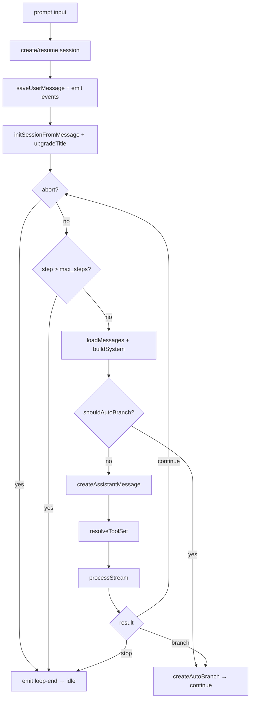

**Cancellation:** `cancel(sessionId)` triggers the session's `AbortController`. The signal propagates through `processStream()`, `Promise.race()` in `toAITool()`, and any active tool execution.

**Tool execution wrapper (`toAITool`):**

Each `ToolDef` is converted to an AI SDK `tool()` with:
1. `fireHook("tool.execute.before")` — plugins can mutate args
2. `Promise.race([def.execute(args, ctx), abortSignalToPromise(signal)])` — cancellable
3. `fireHook("tool.execute.after")` — observe result
4. `toModelOutput()` — handles both text and multi-modal (image) results

### 4.2 Profile System (`src/profile/profile.ts`)

Profiles define agent identity. Each session has exactly one active profile.

**Profile declaration (YAML):**

```yaml
profiles:
  coder:
    prompt_file: profiles/coder.md
    tools: [read, write, edit, bash, skill]
    skills: [code-review]
    model: copilot/claude-sonnet-4.5   # optional override
    sub_agents: [researcher]            # optional
```

**Resolution precedence:**

```
explicit --profile flag
  → config default_profile
    → built-in "coder" fallback
```

**Config hierarchy:**

```
~/.config/quark/config.yaml        (global)
  ↑ merged by
.quark/config.yaml                 (project)
  project profile_overrides:
    tools_add: [deploy]            (additive, not replace)
    skills_add: [runbook]
```

**Built-in profiles:** `coder`, `researcher`, `finder`, `test-engineer`

**Runtime switching:** `/profile <name>` resets `resetProfileCache()` and re-bootstraps without session restart.

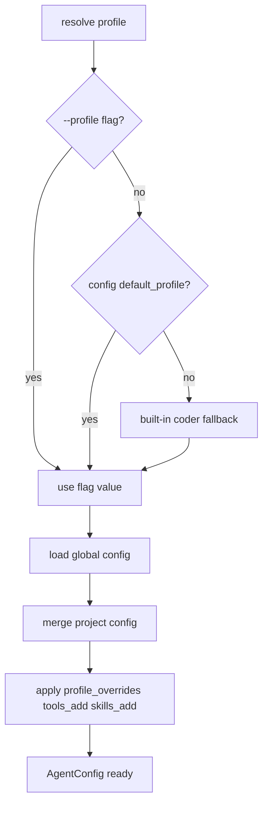

### 4.3 Tool System (`src/tool/`)

**Interface:**

```typescript
interface ToolDef<T extends z.ZodType = z.ZodType> {
  id: string
  description: string
  parameters: T
  execute: (args: z.infer<T>, ctx: ToolContext) => Promise<ToolResult>
}
```

**ToolContext** provides `sessionId`, `messageId`, `callId`, `abort`, `messages`, and `ask()` for permission checks.

**ToolResult** returns `{ output: string | ContentPart[] }` — the multi-part form enables image results.

**Loading chain:**

```
bootstrap()
  ├─ Built-in tools: read, look, skill, question, find_session (always registered)
  └─ External tools: ~/.config/quark/tools/{id}.ts
       → loadToolFiles() — dynamic import, graceful error on failure

resolveTools(agent.tools)
  → filter registry to profile-declared IDs only (no global pool leakage)
```

**Validation:** Registry rejects any tool missing `id`, `description`, a Zod `parameters` type, or an `execute` function, returning a structured `ToolValidationError`.

**Example external tools** (`examples/tools/`): `bash`, `edit`, `glob`, `grep`, `todo`, `websearch`, `write`

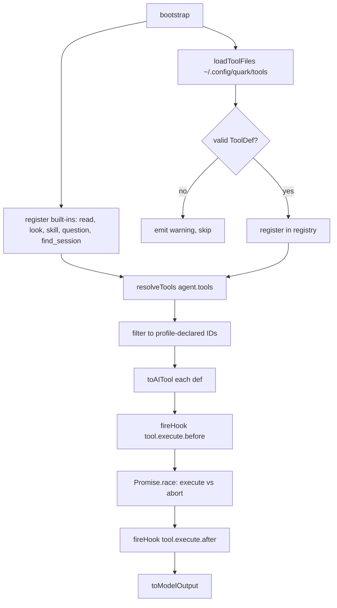

### 4.4 Skill System (`src/skill/skill.ts`)

Progressive context disclosure — only pay tokens for what the agent actually needs.

| Level | Trigger | Cost | Content |
|---|---|---|---|
| L1 Metadata | Profile activation | ~100 tokens/skill | Name + description in system prompt |
| L2 Instructions | Agent calls `skill` tool | Full SKILL.md body | Loaded into context on demand |
| L3 Resources | Never auto-loaded | 0 tokens | Scripts, references — filesystem only |

**Discovery priority:** `.quark/skills/<name>/SKILL.md` (project) overrides `~/.config/quark/skills/<name>/SKILL.md` (global).

**Binding:** Only profile-declared skill names advertise L1 metadata. Non-bound skills are invisible unless explicitly discovered via the skill tool.

**`buildSkillTool()`** wraps discovery + loading as a registered tool callable by the agent.

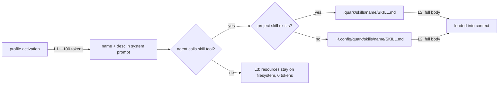

### 4.5 Permission System (`src/permission/permission.ts`)

Wildcard rule evaluation with an async ask/respond lifecycle.

**Rule format:**

```
action: allow | deny | ask
tool:   exact name or wildcard pattern (* ? supported)
args:   argument pattern (optional, trailing ' *' syntax)
```

**Evaluation:** `evaluate()` applies last-matching-rule-wins across merged global + project + session rulesets.

**Ask flow:**

```
evaluate() → action = "ask"
  → ask() enqueues PendingRequest (Map<requestId, {resolve, reject}>)
  → emit "permission-request"
  → UI presents overlay
  → respond(requestId, reply)
       "allow"   → resolve once
       "always"  → creates session-scope allow rule
                   auto-resolves all matching pending requests
       "reject"  → reject → RejectedError halts tool execution
       "correct" → reject → CorrectedError delivers feedback to model
```

**Hard deny:** `evaluate()` → action = "deny" → throws `DeniedError` immediately (no UI prompt).

**`disabled(tools)`** identifies which tools are blanket-denied by `deny + *` rules — used to grey out tools in the TUI.

**Cleanup:** `clearPermissionSession(sessionId)` resolves all pending requests on session end.

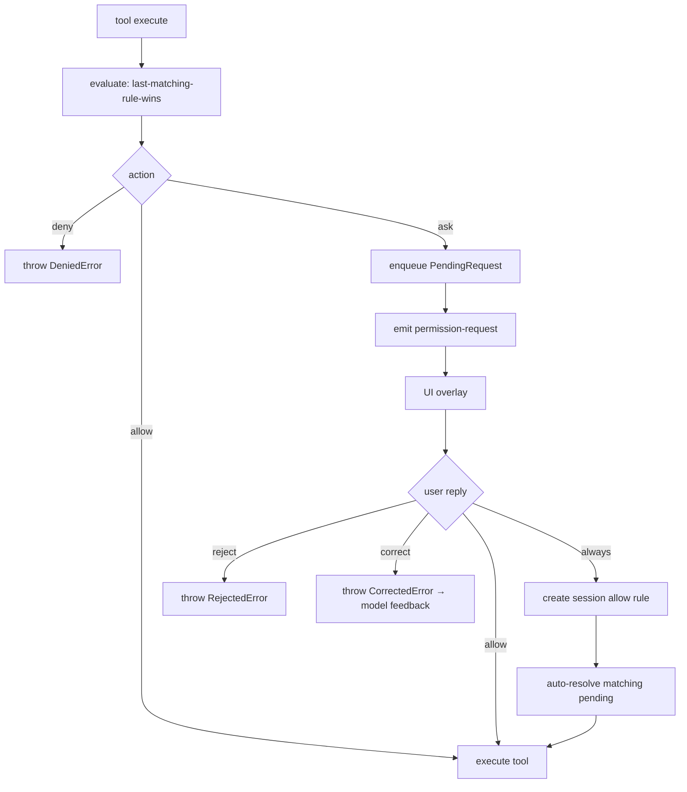

### 4.6 Session Branching (`src/session/branch.ts`, `branch-controller.ts`)

Replaces the old compaction system. When context pressure rises (token usage exceeds threshold), the session auto-branches into a child session — the parent session is frozen and a LLM summary is generated for lineage continuity.

**Trigger heuristic (`shouldAutoBranch`):**

```
estimated_tokens >= threshold × context_window
  where threshold = config.branching.threshold (default: 0.90)
```

The check uses real token data from the previous `step-finish` event when available, falling back to the `chars/4` heuristic.

**Branching flow:**

1. `shouldAutoBranch()` checks token pressure before the model call
2. `createAutoBranch()`:
   a. Splits conversation: recent N turns (kept) vs. old history (summarized)
   b. If no frozen summary exists for this parent yet, generates one via LLM (`SUMMARY_PROMPT`)
   c. Creates a child session with `parentSessionId` + `previousSessionId` lineage
   d. Saves the frozen summary as a system message in the child
   e. Replays recent messages + appends a steer goal
   f. Emits `session-switch` so the TUI updates
3. `processStream()` can also return `"branch"` on context-too-long — same flow triggered mid-response
4. The frozen summary is shared across all sibling branches — generated once, reused forever

**`splitMessages()`:** Strips tool/runtime parts from the conversation, then splits into "old" (summarized) and "recent" (replayed) sets based on `keepMessages`.

**`buildLineageContext()`:** Recursively walks `previousSessionId` chain, prepending each ancestor's frozen summary to form a lineage breadcrumb. This gives the model continuity awareness across multiple branches.

**Key design decisions:**
- **Frozen summaries** — once generated for a parent session, the summary is locked. All child branches share the same parent summary. No more LLM calls per branch.
- **No in-place mutation** — the parent session's message log is never altered. Branching is fork, not mutate.
- **Task-first** — branch summaries distill decisions, constraints, file lists, and goal state rather than raw conversation transcript.

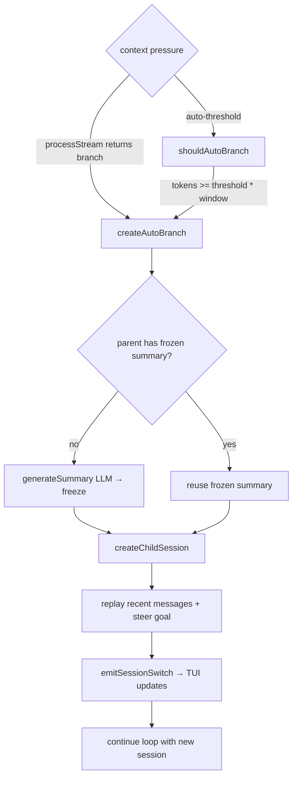

### 4.6b Context Utilities (`src/session/context.ts`)

**`estimateTokens(system, modelMessages)`** — chars/4 heuristic for quick token estimation.

**`getContextWindow(modelLimit)`** — resolves model context window from `models.dev` cache.

**`isOverContextThreshold(inputTokens, contextWindow, threshold)`** — pure percentage comparison.

**`getLastInputTokens(parts)`** — reads the input token count from the most recent `step-finish` part, used to restore the token-percentage bar on session switch.

### 4.7 Provider & Model Routing (`src/provider/resolver.ts`)

**Routing decision tree:**

```
resolveModel(opt, kind)
  │
  ├─ fireHook("provider.request.before")  ← plugins can swap provider/model
  │
  ├─ providerId = "copilot"?
  │     ├─ isClaude(model) AND thinkingBudget > 0?
  │     │     → createCopilotAnthropicProvider()
  │     │       → @ai-sdk/anthropic → api.githubcopilot.com/v1/messages
  │     │         (native Anthropic Messages API — streaming thinking events)
  │     └─ else
  │           → createCopilotProvider()
  │             → @ai-sdk/openai → api.githubcopilot.com
  │               → shouldUseResponsesApi(model)?
  │                     YES (GPT-5+, not gpt-5-mini) → provider.responses(model)
  │                     NO                            → provider.chat(model)
  │
  └─ providerId = "web"?
        → createAlibabaCompatibleProvider()
          → @ai-sdk/alibaba → custom baseURL
            (handles delta.reasoning_content → reasoning events)
        else
          → createOpenAICompatibleProvider()
            → @ai-sdk/openai → config-defined baseURL
```

**Model spec format:** `provider/model` (e.g., `copilot/claude-sonnet-4.5`). Bare names resolve to `copilot`.

**Auth:** Copilot uses a custom fetch wrapper (`copilot-fetch.ts`) that injects `Authorization: Bearer <token>` and `Copilot-Integration-Id` headers. API keys in config support `env:VAR_NAME` indirection.

**Model limits:** `getModelLimit(modelId)` fetches from `models.dev` with a 1-hour in-memory cache.

**Thinking toggle:** `setCopilotThinking(budget)` sets a module-level budget. A budget > 0 routes Claude models to the Anthropic provider; `providerOptions.anthropic.thinking` is passed via `streamText()`.

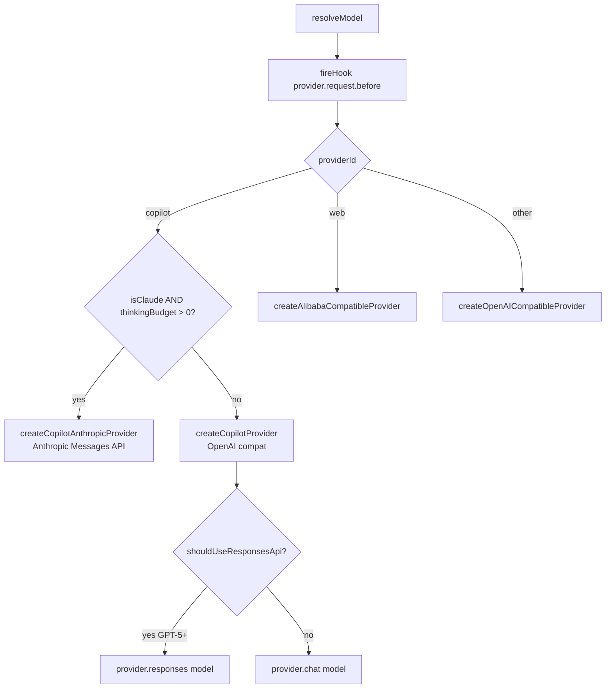

### 4.8 Plugin System (`src/plugin/`)

Drop-in TypeScript plugins with 10 typed hook points.

**Loading:** `loadPlugins()` dynamically imports `~/.config/quark/plugins/*.ts` at bootstrap. Failures emit notifications but never crash.

**Hook points:**

| Hook | Phase | Mutable Output |
|---|---|---|
| `provider.request.before` | Before model creation | `provider`, `model` |
| `provider.request.error` | On retryable error | `retry`, `provider`, `model` |
| `session.created` | After session creation | — |
| `session.idle` | After loop exits | — |
| `session.error` | On unhandled loop error | — |
| `tool.execute.before` | Before tool runs | `args` |
| `tool.execute.after` | After tool completes | — |
| `loop.step.before` | Start of each iteration | — |
| `loop.step.after` | End of each iteration | `result` (`"continue"` / `"stop"` / `"branch"`) |

**Execution:** `fireHook(name, input, mutableOutput?)` runs all registered handlers sequentially. Each handler receives and returns the mutable output object.

**Runtime registration:** `ctx.registerProvider(id, config)` adds a new provider entry without a config file change.

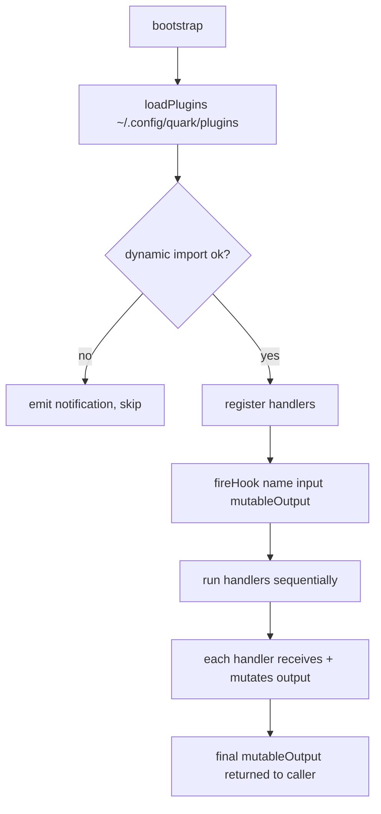

### 4.9 Sub-Agent System

Hierarchical session spawning for task delegation.

**Spawn mechanism:**

```
Parent Bash tool calls:
  quark --sub-agent --profile researcher --prompt "..."
    │
    ├─ Reads QUARK_SESSION_ID from env (set by parent loop())
    ├─ Creates child session: { kind: "subagent", parentSessionId }
    └─ Runs agent loop, writes events to stderr as NDJSON
         (event-writer.ts)
```

**IPC — stderr NDJSON:**

```
{"event":"subagent-tool-start","data":{...}}
{"event":"subagent-tool-end","data":{...}}
{"event":"subagent-text","data":{...}}
```

The parent `Bash` tool parses stderr line-by-line and re-emits these as `subagent-*` events on the parent bus.

**TUI rendering:** `SubAgentView` renders nested tool activity inline under the parent tool call, using tree-line connectors.

**Profile validation:** Unknown sub-agent profile IDs declared in `sub_agents: [...]` emit a warning and are stripped.

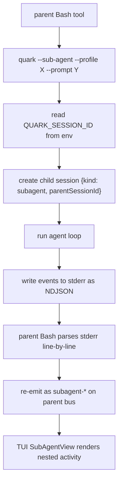

### 4.10 Event Bus (`src/session/events.ts`)

Typed singleton `TypedBus` extending Node `EventEmitter`.

**Full event catalog:**

| Category | Events |
|---|---|
| User | `user-message` |
| Assistant | `assistant-message-start`, `assistant-message-end` |
| Text streaming | `text-start`, `text-delta`, `text-end` |
| Tool lifecycle | `tool-start`, `tool-input`, `tool-running`, `tool-end` |
| Reasoning | `reasoning-start`, `reasoning-delta`, `reasoning-end` |
| Step | `step-start`, `step-finish` |
| Loop | `loop-start`, `loop-end` |
| Permission | `permission-request`, `permission-rejected` |
| Question | `question-request` |
| Retry | `retry` |
| Error | `error`, `context-too-long` |
| Session | `session-created`, `session-reset`, `session-switch`, `model-switched` |
| Branch/Steer | `steer-start`, `steer-end` |
| Undo | `undo-applied` |
| Sub-agent | `subagent-tool-start`, `subagent-tool-input`, `subagent-tool-end`, `subagent-step-finish`, `subagent-text-delta`, `subagent-done` |

**Safety:** Max 100 listeners per event enforced to prevent memory leaks.

**Consumers:** TUI (`wireEvents()` dispatches to SolidJS state), CLI (structured stdout), Web UI (WebSocket relay), plugins.

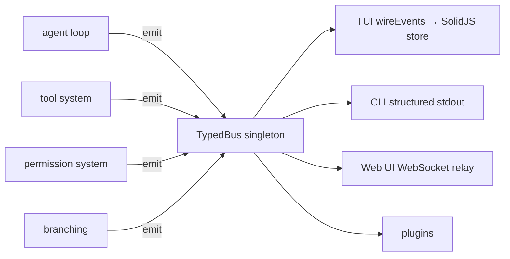

### 4.11 Session Persistence (`src/storage/`)

Append-only JSONL event logs — crash-safe, no WAL needed.

**Layout:**

```
~/.config/quark/session/<id>/
  session.jsonl     # append-only event log
  meta.json         # derived metadata cache (title, timestamps, kind)
```

**Session types:**

| Kind | Storage | Use |
|---|---|---|
| `main` | Disk | Top-level user sessions |
| `subagent` | Disk | Child sessions with `parentSessionId` |
| `ephemeral` | Memory only | `--no-store` flag; never written to disk |

**Operations:** `createSession()`, `getSession()`, `touchSession()`, `setTitle()`, `listSessions()`, `listChildSessions()`

**Message model:**

```
Session
  └─ Message[]  (user | assistant)
       └─ Part[]  (text | tool-call | tool-result | reasoning | image)
```

`toModelMessages()` reconstructs the full `ModelMessage[]` array (including tool call/result pairs) for submission to the LLM on each loop iteration.

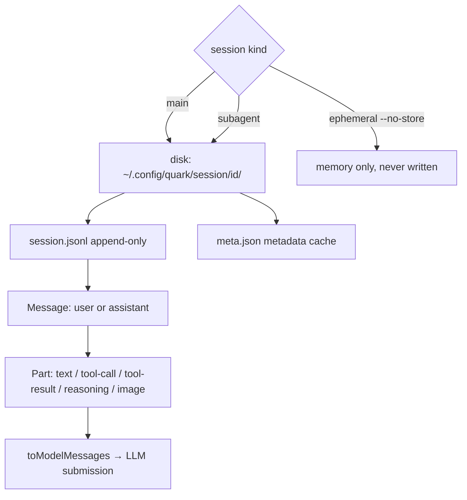

### 4.12 Stream Processing (`src/session/processor.ts`)

`processStream()` calls the AI SDK `streamText()` and handles all event types:

| Stream event | Action |
|---|---|
| `text-delta` | Persist delta, emit `text-delta` on bus |
| `tool-call` | Create tool part, emit `tool-start`, `tool-input` |
| `tool-result` | Persist result, emit `tool-end` |
| `reasoning` | Persist reasoning part, emit `reasoning-*` |
| `step-finish` | Persist usage data, emit `step-finish` |
| `finish` | Emit `assistant-message-end`, return `"stop"` or `"continue"` |
| Context-too-long | Emit `context-too-long`, return `"branch"` |

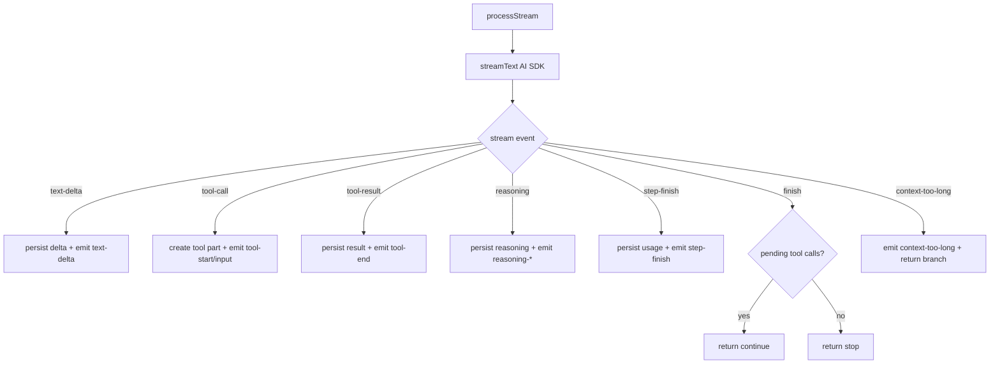

### 4.13 Retry & Error Recovery (`src/session/retry.ts`)

**Retryable errors:** HTTP 429, 5xx, network timeouts, provider overload.

**Not retried:** 401/403, non-429 4xx, `AbortError` (user cancellation).

**Backoff strategy:**

```
delay = min(base * 2^attempt + jitter, 30_000)
  where base ≈ 1000 ms, jitter ∈ [0, 1000) ms
```

**Plugin hook:** `provider.request.error` can set `retry: true` with a replacement `provider`/`model` to implement fallback routing.

**Mid-stream abort:** In-flight tool parts are marked with `status: "error"` when an abort occurs mid-stream.

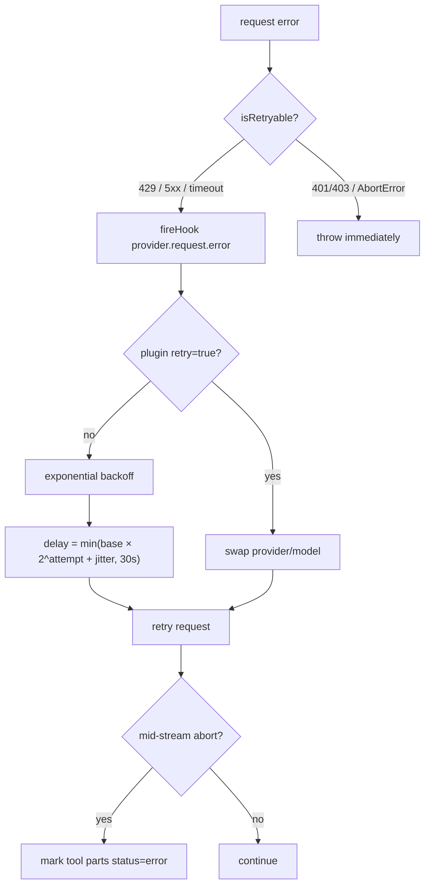

---

## 5. Consumption Surfaces

### 5.1 Interactive TUI (`src/tui/`)

Built on OpenTUI + SolidJS with reactive fine-grained rendering.

**Component tree:**

```
App (src/tui/components/App.tsx)
  ├─ MessageList (scrollable, sticky-bottom)
  │    ├─ UserMessage
  │    ├─ AssistantMessage
  │    │    ├─ WriteStreamView (live text)
  │    │    ├─ ThinkingIndicator (collapsible reasoning)
  │    │    ├─ ToolInvocation
  │    │    │    ├─ DiffView (syntax-highlighted unified diff)
  │    │    │    └─ SubAgentView (nested tool activity + tree-lines)
  │    │    └─ ToolResult
  │    └─ InlineSpinner
  ├─ FooterBar (tokens, cost, model)
  ├─ PromptInput (with history navigation)
  ├─ Autocomplete (fuzzy @file mention)
  ├─ PermissionPrompt (overlay: a=allow, o=always, r=reject)
  ├─ QuestionPrompt (agent-initiated question picker)
  └─ Notifications (solid-background panel)
```

**Slash commands** (`src/tui/commands.ts`):

`/help` `/new` `/sessions` `/clear` `/model` `/profile` `/settings` `/reload-config` `/undo` `/steer` `/goal` `/statistics` `/exit`

**Key bindings:**

| Key | Action |
|---|---|
| `Ctrl+C` / `Esc` | Cancel running agent |
| `Ctrl+T` | Toggle extended thinking |
| `Ctrl+V` | Paste image (creates chip preview) |
| `Tab` / `Backspace` | Navigate / remove image chips |
| `Up` / `Down` | History navigation in input |
| `Ctrl+Z` / `Ctrl+Shift+Z` | Undo / redo in input |

**State management:** `src/tui/state.ts` — reactive SolidJS store. `wireEvents()` in `src/tui/events.ts` subscribes to the bus and dispatches mutations to the store.

**Theme:** Terminal background detection (dark/light) auto-selects syntax highlight theme via `src/tui/terminal-bg.ts`.

### 5.2 CLI (`src/cli.ts`)

One-shot prompt execution for scripted and CI usage.

**Flags:**

| Flag | Description |
|---|---|
| `--prompt <text>` | Run agent with this prompt and exit |
| `--session <id>` | Resume an existing session |
| `--profile <name>` | Select a profile |
| `--model <spec>` | Override model (`provider/model`) |
| `--parent-session <id>` | Link as sub-agent child |
| `--sub-agent` | Run in sub-agent mode (reads QUARK_SESSION_ID) |
| `--no-store` | Ephemeral mode — no disk writes |
| `--list-profiles` | Print available profiles and exit |
| `--help` | Print help and exit |

**Behavior:** No `--prompt` → launches interactive TUI. With `--prompt` → runs `prompt()` and exits.

### 5.3 Web UI (`src/web/`)

Bun HTTP + WebSocket server with React 19 SPA client.

**REST API:**

| Endpoint | Method | Description |
|---|---|---|
| `/api/health` | GET | Liveness check |
| `/api/sessions` | GET | List sessions |
| `/api/sessions/:id/messages` | GET | Fetch session messages |
| `/api/sessions/:id/status` | GET | Check if session is active |
| `/api/sessions` | POST | Create a new session |
| `/api/prompt` | POST | Run agent loop (`{ text, images?, sessionId?, context? }`) |
| `/api/cancel` | POST | Cancel running session |
| `/api/model` | GET / POST | Get or set active model |
| `/api/thinking` | GET / POST | Get or toggle extended thinking |
| `/api/permission` | POST | Respond to pending permission request |
| `/api/profiles` | GET | List profiles |
| `/api/models` | GET | List available models |
| `/api/config` | GET | Read config (model, context window, max steps) |
| `/api/files` | GET | List workspace files (fuzzy-filtered for mention picker) |
| `/api/workspace/file` | GET / POST | Read/write workspace files |

**WebSocket:** `/ws` — relays all 35+ bus events to connected clients as JSON frames in real-time.

**Client components** (`src/web/client/components/`):

- `InputArea` — text input, image attachment, @mention picker, slash command palette
- `MessageItem` — renders user/assistant messages including image thumbnails
- `PermissionDialog` — permission overlay
- `CommandPalette` — slash command picker (triggered by `/` key or button)
- `MentionPicker` — file/directory picker (triggered by `@` key or button)

### 5.4 Desktop (`quark-desktop/`)

Tauri 2 + React 19 desktop app. Quark core runs as a **Tauri sidecar** — a Bun-compiled binary configured as `externalBin`. The React frontend connects to the sidecar's REST + WebSocket API, same as the web UI.

**Layout:**

```
┌──────────┐  ┌──────────────────────────────┐  ┌────────────────┐
│  Left    │  │         Middle Pane           │  │   Right Pane   │
│  Pane    │  │                                │  │                │
│          │  │  ┌────── Diff Review ────────┐ │  │  Agent Chat    │
│ File     │  │  │  ▲ Edit Permission         │ │  │  (React SPA)  │
│ Tree     │  │  │  context line              │ │  │                │
│          │  │  │ - old line                  │ │  │  WebSocket    │
│ Commands │  │  │ + new line                  │ │  │  events       │
│          │  │  │  [Approve][Reject][Correct]│ │  │                │
│          │  │  └───────────────────────────┘ │  │  REST API     │
│          │  │  ┌────── Source (CodeMirror) ─┐│  │  calls        │
│          │  │  └───────────────────────────┘ │  │                │
│          │  │  ┌────── Preview (HTML) ──────┐│  │                │
│          │  │  └───────────────────────────┘ │  │                │
└──────────┘  └──────────────────────────────┘  └────────────────┘
```

**Sidecar startup:**
1. Tauri spawns `quark-server` (Bun `--compile` binary) as `externalBin`
2. Tauri polls `GET /api/health` until 200
3. Passes backend URL to React via window or IPC
4. React connects WebSocket + REST to sidecar

**Communication flow (frontend ↔ backend):**

```
┌──────────────────────────────────────────────────────────────────────────┐
│  Tauri Desktop (React)                                                    │
│                                                                           │
│  ┌──────────┐  ┌──────────────────┐  ┌────────────────────────────────┐  │
│  │ LeftPane │  │   MiddlePane     │  │  RightPane (Chat)               │  │
│  │          │  │                  │  │                                 │  │
│  │ click    │  │  <DiffReview/>   │  │  <MessageList/>                 │  │
│  │  │       │  │       │          │  │       ▲                         │  │
│  │  ▼       │  │       ▼          │  │       │ WS: text-delta          │  │
│  │ GET      │  │  POST            │  │       │ WS: tool-input          │  │
│  │ /api/    │  │  /api/           │  │       │ WS: tool-end            │  │
│  │ workspace│  │  permission      │  │       │ WS: permission-request  │  │
│  │ /file    │  │       │          │  │       │                         │  │
│  │  │       │  │       │          │  │  <Omnibar/>                     │  │
│  │  │       │  │       │          │  │       │                         │  │
│  │  │       │  │       │          │  │       ▼                         │  │
│  │  │       │  │       │          │  │  POST /api/prompt               │  │
│  └──┼───────┘  └───────┼──────────┘  └───────────────┼────────────────┘  │
│     │                  │                             │                    │
│     │    fetch()       │    fetch()       WebSocket  │   fetch()          │
└─────┼──────────────────┼─────────────────┼──────────┼────────────────────┘
      │                  │                 │          │
      ▼                  ▼                 ▼          ▼
┌──────────────────────────────────────────────────────────────────────────┐
│  Quark Backend (Sidecar) · Bun HTTP + WebSocket server                    │
│                                                                           │
│  ┌──────────────────────────────────────────────────────────────────┐    │
│  │                         REST API                                  │    │
│  │  GET  /api/health              → { status: "ok" }                 │    │
│  │  GET  /api/workspace/file      → { content, mtime, size }         │    │
│  │  POST /api/workspace/file      → { ok: true }                     │    │
│  │  POST /api/prompt              → runs agent loop, returns result  │    │
│  │  POST /api/permission          → resolves pending request         │    │
│  │  POST /api/cancel              → abort controller                 │    │
│  └──────────────────────────────────────────────────────────────────┘    │
│                                                                           │
│  ┌──────────────────────────────────────────────────────────────────┐    │
│  │                      WebSocket /ws                                │    │
│  │                                                                    │    │
│  │  server.ts subscribes to TypedBus                                  │    │
│  │    │                                                               │    │
│  │    ├─ "text-delta"          → WS frame: { event, data }           │    │
│  │    ├─ "tool-input"          → WS frame: { tool, args, diff }      │    │
│  │    ├─ "tool-end"            → WS frame: { tool, output }          │    │
│  │    ├─ "permission-request"  → WS frame: { requestId, tool, ... }  │    │
│  │    ├─ "assistant-message-*" → WS frame: { messageId, ... }        │    │
│  │    └─ ... (all 35+ events)                                        │    │
│  └──────────────────────────────────────────────────────────────────┘    │
│                                                                           │
│  ┌──────────────────────────────────────────────────────────────────┐    │
│  │                    TypedBus (internal)                             │    │
│  │                                                                    │    │
│  │  Agent Loop ──→ emit ──→ TypedBus ──→ subscribers                 │    │
│  │  Tool System ──→ emit       ▲  ▲        ├─ WebSocket relay        │    │
│  │  Permission ───→ emit      │  │        ├─ Session persistence     │    │
│  │  Branching ────→ emit      │  │        └─ Plugins                 │    │
│  │                             │  │                                   │    │
│  │  Desktop never touches the bus directly — only via WebSocket      │    │
│  └──────────────────────────────────────────────────────────────────┘    │
└──────────────────────────────────────────────────────────────────────────┘
```

**Key: React → Backend (request/response):**

```
LeftPane.click("file.ts")
  │
  ▼
fetch("GET /api/workspace/file?path=file.ts")
  │
  ▼
Bun file read → { content, mtime, size }
  │
  ▼
SourceEditor displays content

────────────────────────────────────────────

Omnibar.submit("fix the header")
  │
  ▼
fetch("POST /api/prompt", { text: "fix the header", context: "..." })
  │
  ▼
Backend runs agent loop → emits events to bus → WebSocket relays to React
  │
  ▼
RightPane updates chat, MiddlePane may show diff review

────────────────────────────────────────────

DiffReview.userClicks("Approve")
  │
  ▼
fetch("POST /api/permission", { requestId, reply: "once" })
  │
  ▼
permission.respond() → resolves pending request → tool executes
  │
  ▼
WebSocket emits "tool-end" → MiddlePane reloads source/preview
```

**Key: Backend → React (streaming events):**

```
Agent proposes edit(filePath, oldString, newString)
  │
  ▼
toAITool.execute() → askPermission() → bus.emit("permission-request")
  │
  ▼
server.ts WebSocket relay → JSON frame to desktop
  │
  ▼
Desktop state → MiddlePane: DiffReview shows diff
  │
  ▼
User approves → POST /api/permission
  │
  ▼
permission.respond("once") → tool executes → file written
  │
  ▼
bus.emit("tool-end") → WebSocket → desktop
  │
  ▼
Desktop reloads file in SourceEditor + HtmlPreview
```

**Diff workflow (V1 proof):**
1. Agent proposes `edit()`/`write()` → backend emits `tool-input` with `diff` metadata
2. Desktop WebSocket receives event → middle pane switches to `DiffReview` mode
3. User reviews unified diff, clicks Approve (once/always), Reject, or Correct
4. Desktop calls `POST /api/permission` with the reply
5. Approved → tool executes, file written → `tool-end` → source/preview reload
6. Rejected → tool blocked, agent may retry

**API extensions for desktop:**
| Endpoint | Method | Description |
|---|---|---|
| `/api/workspace/file?path=...` | GET | Read file: `{ content, mtime, size }` |
| `/api/workspace/file` | POST | Write file: `{ path, content }` → `{ ok: true }` |
| `/api/prompt` (extended) | POST | New optional field: `context` — prepended to user message |

**Desktop React state:**

```ts
interface DesktopState {
  activeFile: string | null
  activeDraft: string | null
  activeView: "diff" | "source" | "preview"
  activeReview: {
    messageId: string; callId: string; tool: string
    filePath: string; diff: string
    input: Record<string, unknown>
    permissionRequestId: string
  } | null
}
```

**Key design decisions:**
- **Thin shell** — does not replace TUI or web UI; adds a shared workspace view
- **File source is canonical** — human draft edits are ephemeral until explicit save
- **Chat components shared** with `src/web/client/` — no fork of the chat UI
- **macOS first** — Windows/Linux packaging deferred to V2
- **V1 scope** — diff review + source editor (CodeMirror) + HTML preview only

---

## 6. Configuration

### 6.1 Global Config (`~/.config/quark/config.yaml`)

```yaml
main_model: copilot/claude-sonnet-4.5
small_model: copilot/gpt-4o-mini
models: [gpt-4o, claude-sonnet-4.5, gemini-2.5-pro]
max_steps: 100

branching:
  auto: true
  threshold: 0.90

providers:
  ollama:
    baseURL: http://localhost:11434/v1
    apiKey: env:OLLAMA_API_KEY    # env: prefix = resolve from environment

profiles:
  coder:
    prompt_file: profiles/coder.md
    tools: [read, write, edit, bash, skill]
    skills: [code-review]
```

### 6.2 Project Config (`.quark/config.yaml`)

```yaml
profile_overrides:
  coder:
    tools_add: [deploy, test-runner]    # additive — merged with profile tools
    skills_add: [django-patterns]       # additive — merged with profile skills
```

### 6.3 Agent Instructions

| File | Scope |
|---|---|
| `~/.config/quark/AGENTS.md` | Global — prepended to all sessions |
| `./AGENTS.md` | Project-level — prepended when running in this directory |

Both are included in `buildSystem()` output, before the profile prompt.

---

## 7. File System Layout

```
~/.config/quark/
  config.yaml               # global config
  AGENTS.md                 # global agent instructions
  profiles/                 # system prompt markdown files
    coder.md
    researcher.md
    finder.md
    test-engineer.md
  skills/                   # global skills
    code-review/
      SKILL.md              # L1+L2: name, description, full instructions
      checklist.md          # L3: resource (never auto-loaded)
  tools/                    # external tool definitions
    deploy.ts
    test-runner.ts
  plugins/                  # lifecycle plugins
    fallback-model.ts
  session/                  # persisted sessions
    <id>/
      session.jsonl         # append-only event log
      meta.json             # fast-read metadata cache

.quark/                     # project-level overrides (co-located with code)
  config.yaml
  AGENTS.md
  skills/
    deploy-runbook/
      SKILL.md

AGENTS.md                   # project root — same as .quark/AGENTS.md (either works)
```

---

## 8. SDK Public API

**Entry point:** `@quark/sdk` (`src/index.ts`)

**Functions**

| Export | Source | Description |
|---|---|---|
| `bootstrap` | `bootstrap.ts` | Initialize tools and skills for a session |
| `prompt` | `session/prompt.ts` | Run the agent loop |
| `cancel` | `session/prompt.ts` | Cancel an in-flight session |
| `isActive` | `session/prompt.ts` | Check if a session is running |
| `createSession` / `getSession` | `session/session.ts` | Session CRUD |
| `createTask` / `getTask` / `listTasks` / `updateTask` | `task/task.ts` | Task CRUD |
| `createBranch` / `autoBranch` / `buildLineageContext` / `getSessionLineage` / `shouldBranchWithRealTokens` / `splitMessages` | `session/branch.ts` | Session branching API |
| `register` / `listTools` | `tool/registry.ts` | Tool registry |
| `defineTool` | `tool/tool.ts` | Type-safe tool factory |
| `resolveProfile` / `listProfiles` / `readPromptFile` / `resetProfileCache` | `profile/profile.ts` | Profile system |
| `agentFromProfile` / `defaultAgent` | `agent.ts` | Build AgentConfig |
| `bus` | `session/events.ts` | Event bus |
| `evaluatePermission` / `askPermission` / `respondPermission` | `permission/permission.ts` | Permission system |
| `listPendingPermissions` / `clearPermissionSession` / `disabledTools` | `permission/permission.ts` | Permission helpers |
| `respondQuestion` | `tool/question.ts` | Respond to agent question requests |

### Types

```typescript
// Tools
ToolDef<T>        ToolContext        ToolResult        ToolResultContentPart
ToolValidationError

// Sessions
Session           SessionKind

// Agent
AgentConfig

// Profiles
ProfileDef        ProfileConfig      PromptFileResult

// Events
BusEvents         BusEventName

// Permissions
Rule              Ruleset            Action             Reply
PendingRequest    DeniedError        RejectedError      CorrectedError

// Plugins
PluginFn          PluginContext       PluginHooks

// Questions
QuestionResponse
```

---

## 9. Security Considerations

- API keys resolved via `env:VAR_NAME` indirection — never stored in plaintext config
- Permission system gates all tool execution — `deny` rules block immediately without UI prompt
- Ephemeral sessions (`--no-store`) never written to disk
- Copilot auth token managed via separate login flow, stored separately from config
- No secrets or keys logged in bus events or tool output
- Sub-agent processes inherit only `QUARK_SESSION_ID` — not the parent's full environment

---

## 10. Epic Roadmap

### Completed (v0.1.0)

| Epic | Title | Requirements |
|---|---|---|
| EPIC-01 | Core Agent Loop & Session Engine | FR-1 |
| EPIC-02 | Profile System | FR-2 |
| EPIC-03 | Tool System | FR-3 |
| EPIC-04 | Skill System | FR-4 |
| EPIC-05 | Permission System | FR-5 |
| EPIC-06 | Session Branching (formerly Context Compaction) | FR-6 |
| EPIC-07 | Provider & Model System | FR-7 |
| EPIC-08 | Plugin System | FR-8 |
| EPIC-09 | Sub-Agent System | FR-9 |
| EPIC-10 | Interactive TUI | FR-10 |
| EPIC-11 | Extended Thinking (Reasoning) | FR-11 |
| EPIC-12 | Retry & Error Recovery | FR-12 |
| EPIC-14 | Session Title Generation | FR-14 |
| EPIC-15 | Event Bus | FR-15 |

### In Progress

| Epic | Title | Requirements |
|---|---|---|
| EPIC-13 | SDK & CLI Distribution | FR-13 |

### Planned

| Epic | Title | Requirements |
|---|---|---|
| EPIC-16 | Web UI — Image Attachment Pipeline | FR-16 |
| EPIC-17 | Quark Desktop V1 — Shared Diff Workspace | FR-17 |

---

## 11. References

- [Anthropic: Building Effective Agents](https://www.anthropic.com/research/building-effective-agents)
- [Anthropic: Effective Harnesses for Long-Running Agents](https://www.anthropic.com/engineering/effective-harnesses-for-long-running-agents)
- [Martin Fowler: Harness Engineering](https://martinfowler.com/articles/exploring-gen-ai/harness-engineering.html)
- [Agent Skills Open Standard](https://agentskills.io)
- [PRD](./PRD.md)
- [Epics](./epics.json)
- [Quark Desktop Spec](./quark-desktop-tauri.md) — EPIC-17: Tauri 2 desktop app with shared diff workspace
- [`quark-desktop/` prototype](../quark-desktop/) — existing static HTML/CSS mockup
